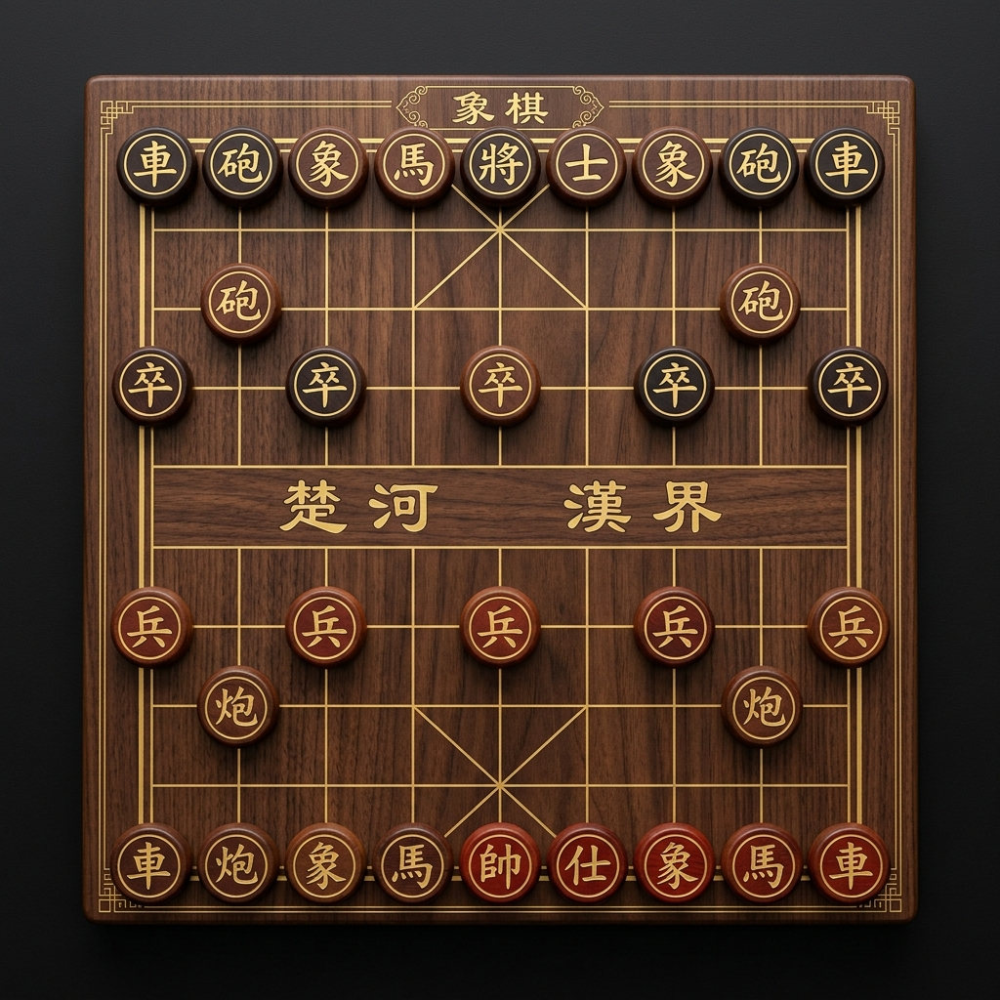

# Xiangqi Pro | Premium Chinese Chess

Xiangqi Pro is a high-fidelity, professional web application for playing Chinese Chess (Xiangqi). It features a modern glassmorphism design, advanced AI capabilities, and seamless multiplayer integration.



## 🚀 Features

- **Multi-Mode Gameplay**:
  - **AI Match**: Play against a sophisticated engine with adjustable difficulty (Easy, Medium, Hard).
  - **Online Multiplayer**: Create private rooms and compete with players worldwide via Socket.IO.
  - **Local Pass & Play**: Enjoy a match with a friend on the same machine.
- **Modern Interface**: Premium dark-mode aesthetic with smooth animations and interactive board elements.
- **Live Match Feedback**:
  - Real-time move history tracking.
  - Interactive "Hint" system for learning.
  - Synchronized game timers for competitive play.
- **Educational Content**: Built-in rules, piece movement guides, and historical context for new players.
- **Secure Authentication**: Robust user registration and login system with password complexity enforcement.

## 🛠️ Technology Stack

- **Backend**: Flask (Python)
- **Database**: SQLite (SQLAlchemy ORM)
- **Real-time**: Flask-SocketIO (Eventlet)
- **Frontend**: Vanilla JavaScript (ES6+), HTML5, CSS3
- **Design**: Modern Glassmorphism & Responsive Layout

## 📦 Installation & Setup

1. **Clone the repository**:
   ```bash
   git clone <repository-url>
   cd "Chinese Chess"
   ```

2. **Install dependencies**:
   ```bash
   pip install flask flask-sqlalchemy flask-socketio flask-bcrypt flask-login eventlet
   ```

3. **Run the application**:
   ```bash
   python app.py
   ```

4. **Access the game**:
   Open your browser and navigate to `http://127.0.0.1:8080`.

## 📂 Project Structure

- `static/`: Contains all CSS, JS, and image assets.
- `templates/`: HTML templates for the dashboard and authentication.
- `engine/`: Core Xiangqi logic and AI engine.
- `models.py`: Database models for users and game sessions.
- `app.py`: Flask application routes and Socket.IO event handlers.

## 📜 License

This project is open-source. Feel free to contribute or modify!
